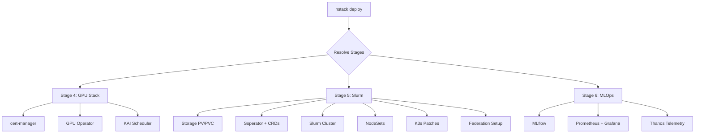
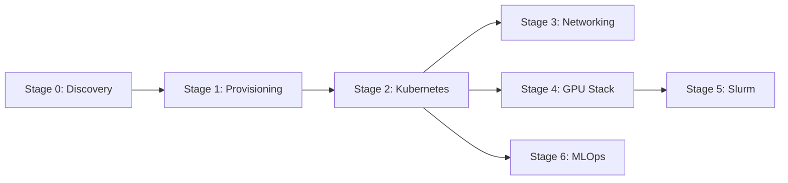
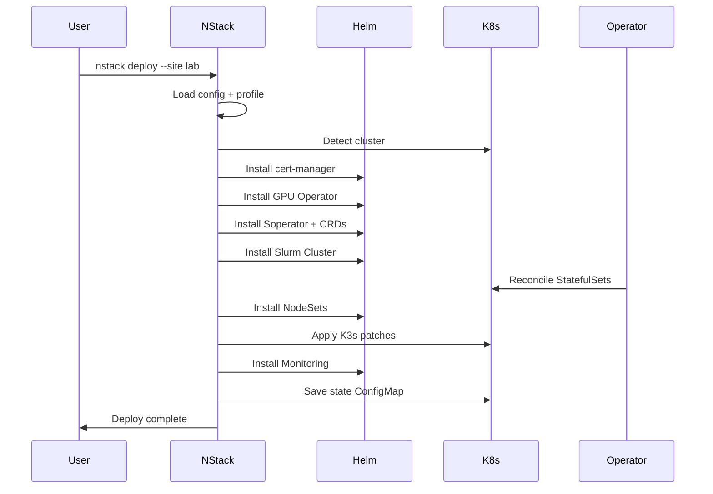
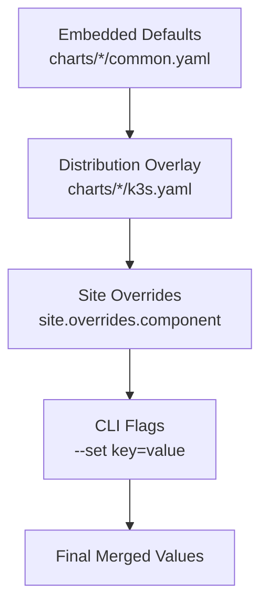
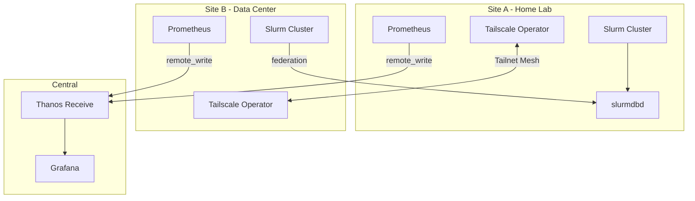

# NStack System Architecture

This document describes the internal architecture of NStack, including the staged pipeline, dependency resolution, configuration hierarchy, and multi-site federation model.

## High-Level Overview

NStack is a single Go binary that orchestrates the deployment of NVIDIA GPU infrastructure, Slurm workload management, and MLOps tooling on Kubernetes clusters. It uses a staged pipeline where each stage handles a distinct layer of the infrastructure stack.

The core components are:

- **Pipeline** (`pkg/engine/pipeline.go`) -- orchestrates stage execution in dependency order
- **Registry** (`pkg/engine/registry.go`) -- holds all registered stages and resolves which to run
- **Stage interface** (`pkg/engine/stage.go`) -- the contract every deployment stage implements
- **State store** (`pkg/state/store.go`) -- ConfigMap-backed persistence for deployment state
- **Helm values** (`pkg/helm/values.go`) -- multi-layer value merging for chart configuration
- **Profiles** (`internal/assets/profiles/`) -- embedded environment presets (k3s-single, kubeadm, etc.)

## Pipeline Flow

The deploy command triggers the pipeline, which resolves the requested stages, validates dependencies, and executes each stage through a plan/validate/apply lifecycle.



## Stage Dependency Graph

Stages declare their dependencies via `Dependencies() []int`. The pipeline validates that every dependency is either included in the current run or already deployed in the state store.



Key observations:

- **Stages 3, 4, and 6 have no inter-dependencies** -- they can run in parallel when `--parallel` is used.
- **Stage 5 (Slurm) depends on Stage 4 (GPU Stack)** because Slurm needs the GPU Operator and cert-manager deployed first (the soperator webhook requires cert-manager certificates).
- **Stages 0-2 form a linear chain** for bare-metal-to-Kubernetes bootstrapping. Most users start at Stage 4 with an existing cluster.

### Parallel Execution Model

When `--parallel` is set, the pipeline groups stages into dependency levels using `assignLevels()` (`pkg/engine/pipeline.go:232`). Stages at the same level run concurrently; levels are processed in order. If any stage in a level fails, subsequent levels are not started.

```
Level 0: S0 (or S4 if starting from --from stage4)
Level 1: S1 (or S3, S5, S6 in parallel)
Level 2: S2
...
```

## Deploy Sequence

This is the detailed sequence of operations when running `nstack deploy --site lab` against a cluster that already has Kubernetes running.



### Stage Execution Lifecycle

Every stage goes through the same lifecycle in `Pipeline.executeStage()`:

1. **Check state** -- if already deployed and `--force` is not set, skip.
2. **Plan** -- call `stage.Plan()` to determine what actions are needed. Returns a `StagePlan` with component-level actions (`install`, `upgrade`, `skip`).
3. **Dry run check** -- if `--dry-run` is set, print the plan and stop.
4. **Skip check** -- if the plan action is `skip`, move on.
5. **Validate** -- call `stage.Validate()` to confirm prerequisites (cluster reachable, etc.).
6. **Apply** -- call `stage.Apply()` which installs Helm charts, creates K8s resources, and applies patches.
7. **Record state** -- save success or failure to the ConfigMap in `nstack-system` namespace.

## Config Hierarchy

NStack uses a four-layer value merging system. Each layer overrides the previous one, with later layers taking precedence.



### Layer Details

| Layer | Source | Example |
|-------|--------|---------|
| **Embedded defaults** | `internal/assets/charts/<component>/common.yaml` | Base Helm values for every environment |
| **Distribution overlay** | `internal/assets/charts/<component>/<dist>.yaml` | K3s-specific patches (containerd socket, cgroup config) |
| **Site overrides** | `site.overrides.<component>` in config YAML | User-specified values per component per site |
| **CLI flags** | `--set gpu-operator.driver.enabled=false` | One-off overrides without editing config |

The merge is performed by `helm.LoadChartValues()` (`pkg/helm/values.go:14`) and `helm.MergeValues()` (`pkg/helm/values.go:44`). Nested maps merge recursively; scalar values and slices are replaced entirely.

### Version Resolution

Component versions follow a similar precedence chain:

1. **Compiled default** -- hardcoded in stage source (e.g., `soperatorVersion = "3.0.2"` in `pkg/stages/s5_slurm/soperator.go`).
2. **Site override** -- `site.versions.soperator: "3.1.0"` in config YAML.

Resolution happens via `config.ResolveVersion()` (`pkg/config/versions.go`).

## Multi-Site Federation

NStack supports connecting Slurm clusters across geographically separated sites using Tailscale overlay networking, federated job scheduling via sacctmgr, and unified telemetry via Thanos.



### Federation Components

**Tailscale overlay** (`pkg/stages/s3_networking/overlay.go`):
- Deploys the Tailscale Kubernetes Operator via Helm.
- Configures subnet routes so pod CIDRs are routable across sites.
- Annotates the slurmdbd service with `tailscale.com/expose: true` for MagicDNS reachability.

**Slurm federation** (`pkg/stages/s5_slurm/federation.go`):
- Executes sacctmgr commands inside the controller pod to create the federation and add the local cluster.
- Sets cluster features (e.g., `has-h100`, `has-imagenet`) for data-locality-aware job routing.
- All names are validated against `[a-zA-Z0-9_-]+` to prevent shell injection.

**Cross-site telemetry** (`pkg/stages/s6_mlops/monitoring.go`):
- Configures Prometheus `remote_write` to a Thanos Receive endpoint.
- Adds `cluster` and `site` external labels for query-time filtering.
- Grafana dashboards provide a unified view across all federated sites.

### Accounting Architecture

One site is designated as the accounting host (with `accounting.deploy: true`). That site runs slurmdbd and the MariaDB database. All other sites point their `AccountingStorageHost` to the accounting host's Tailscale MagicDNS name (e.g., `slurm-home-slurmdbd.your-tailnet.ts.net`).

## State Management

NStack tracks deployment state in a Kubernetes ConfigMap stored in the `nstack-system` namespace. Each site gets its own ConfigMap named `nstack-state-<siteName>`.

The state structure (`pkg/state/types.go`):

```
State
  Site: string
  Profile: string
  Stages: map[int]*StageState
    StageState
      Status: "deployed" | "failed" | "not-installed"
      Version: string
      Applied: time.Time
      Components: map[string]*ComponentState
      Error: string (on failure)
```

State is checked before each stage execution. If a stage shows `status: deployed`, it is skipped unless `--force` is used. Failed stages record the error message for debugging.

## Project Structure

```
nstack/
  cmd/nstack/           # CLI commands (cobra)
    main.go             # Entry point
    root.go             # Global flags (--site, --config, --output)
    stages.go           # Stage registration (buildRegistry)
    deploy_cmd.go       # nstack deploy
    destroy_cmd.go      # nstack destroy
    detect_cmd.go       # nstack detect
    init_cmd.go         # nstack init
    plan_cmd.go         # nstack plan (dry-run)
    status_cmd.go       # nstack status
    upgrade_cmd.go      # nstack upgrade
    validate_cmd.go     # nstack validate
    helpers.go          # Shared CLI helpers

  pkg/
    config/             # Config loading, profiles, version resolution
      types.go          # All config structs (Site, Profile, Federation, etc.)
      loader.go         # YAML loading from ~/.nstack/config.yaml
      profiles.go       # Embedded profile loading from internal/assets/
      versions.go       # ResolveVersion helper

    engine/             # Pipeline orchestration
      stage.go          # Stage interface + plan/status types
      registry.go       # Stage registry + dependency resolution
      pipeline.go       # Sequential and parallel execution
      helpers.go        # Shared detect/plan/status helpers
      constants.go      # Shared namespace constants

    helm/               # Helm client and value merging
      client.go         # Helm SDK wrapper (install, upgrade, uninstall)
      values.go         # LoadChartValues, MergeValues, ParseSetValues
      repos.go          # Repository configuration

    kube/               # Kubernetes client wrapper
      client.go         # Client creation from kubeconfig
      crd.go            # CRD application
      patch.go          # Strategic merge patches
      wait.go           # Wait-for-condition helpers

    stages/             # Stage implementations
      s0_discovery/     # BMC/IPMI/Redfish scanning
      s1_provision/     # Metal3/Ironic bare metal provisioning
      s2_kubernetes/    # K3s/kubeadm bootstrap
      s3_networking/    # Network Operator, Multus, DOCA, Tailscale
      s4_gpu/           # cert-manager, GPU Operator, KAI Scheduler
      s5_slurm/         # Soperator, Slurm cluster, NodeSets, federation
      s6_mlops/         # MLflow, kube-prometheus-stack, dashboards

    state/              # ConfigMap-backed state persistence
      types.go          # State, StageState, ComponentState
      store.go          # Load/Save/EnsureNamespace

    output/             # Terminal output formatting
      printer.go        # Colored, structured output
      json.go           # JSON output mode

  internal/assets/      # Embedded filesystem (go:embed)
    assets.go           # embed.FS declaration
    charts/             # Per-component Helm value files
      gpu-operator/     # common.yaml, k3s.yaml
      soperator/        # common.yaml, k3s.yaml
      slurm-cluster/    # common.yaml, k3s.yaml, federation.yaml
      nodesets/          # common.yaml, k3s.yaml
      monitoring/        # common.yaml, k3s.yaml
      mlflow/           # common.yaml
      network-operator/ # common.yaml, infiniband.yaml, roce.yaml
      kai-scheduler/    # common.yaml
      doca/             # common.yaml
    profiles/           # Environment presets
      k3s-single.yaml
      k3s-multi.yaml
      kubeadm.yaml
      nebius.yaml
```
